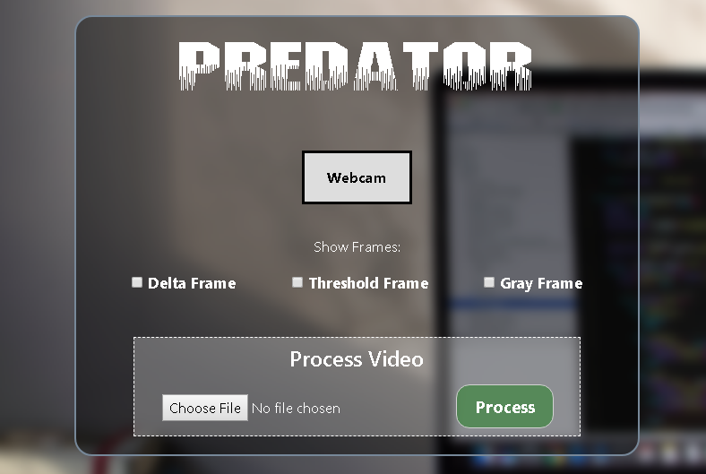
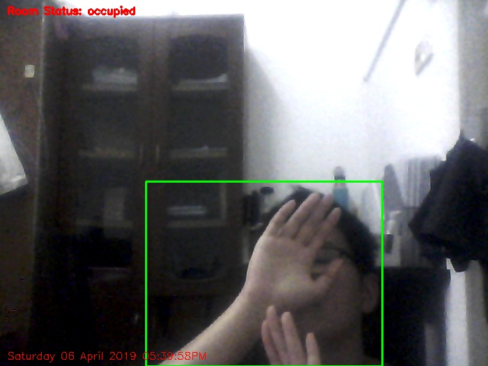
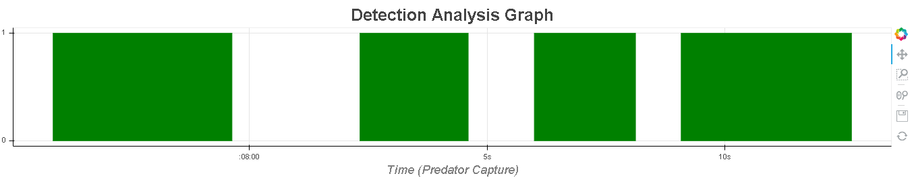
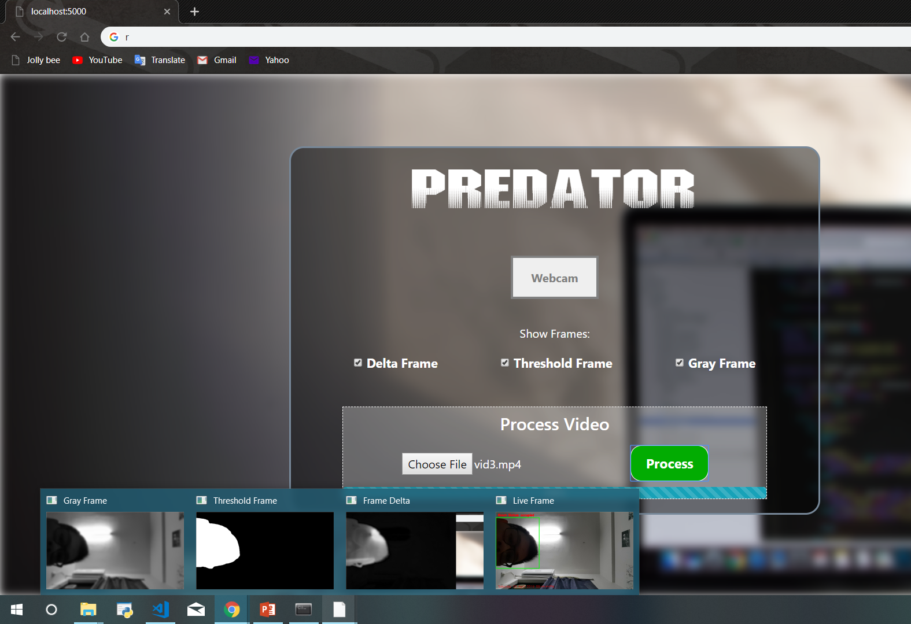
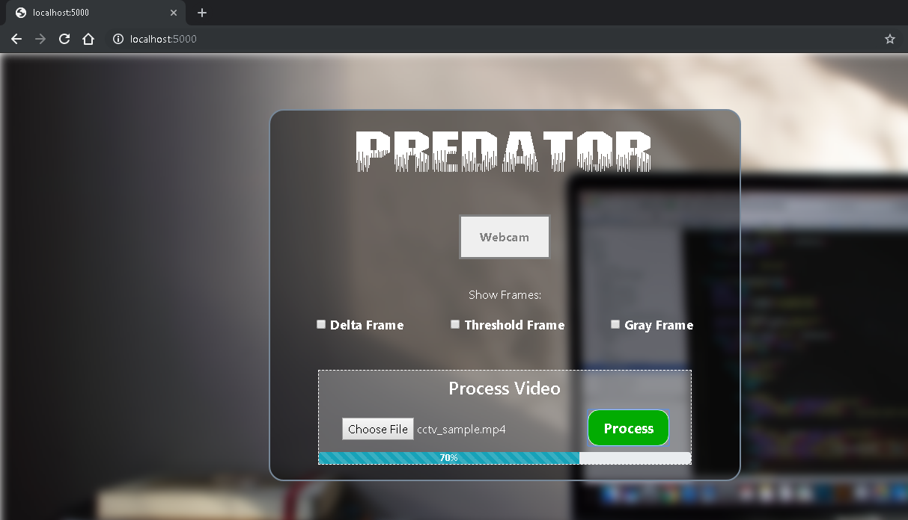
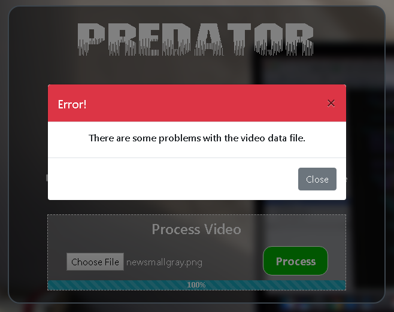

# Predator - Presence & Motion Detector
Predator (Presence &amp; Motion Detector) is a basic web app to perform presence and motion detection using real time webcam feed or from recorded video stream.

<h2>Tools</h2>
The application backend is developed in Python and the frontend is done in Web (HTML, CSS, JS, etc.).

<h2>Requirements</h2>
<ol>
  <li>Any OS: preferably Windows 7 above.</li>
  <li>Working web browser, preferably Google Chrome.</li>
  <li>Internet connection with access to Google services (for some jQuery and ajax in the interface).</li>
  <li>Python module/dependencies based on the packages:</li>
 
      ```
      bokeh==0.13.0
      Flask==1.0.2
      imutils==0.5.2
      opencv-python==3.4.5.20
      pandas==0.23.4
      Werkzeug==0.14.1
      ```
      
 </ol>
 <h2>How to run?</h2>
 <ol>
  <li>Open terminal/command prompt/Anaconda Prompt</li>
  <li>Navigate to root folder containing 'predator.py'</li>
  <li>Type the command:</li>
  
    ```
    python predator.py
    ```
  <li>Open a web browser, type in url: localhost:5000 or 127.0.0.1:5000, if the application is not automatically opened and run.</li>
</ol>

<h2>Using</h2>
<p>Now that the web app is successfully launched, we should see this interface below.
</p>
<p>The first button labeled 'Webcam' is for capturing motion using our computer's webcam. We can also choose to display
any intermediate frames for the process of motion detecting. In the frames, room status and current time will also be displayed.
Then the last section is for processing recorded videos to capture any motion in any . mp4 videos. After each finished operation, a corresponding Detection Analysis Graph will be generated and shown, together with a .csv file with the timing of motion detected. Each frame with any motion capture will also be saved as 'security photo' using the timestamp as the folder and file name.
</p>
 
<h2>Screenshots</h2>
<ul>
  <li><strong>Webcam feed</strong></li>
    <hr/>
  <li><strong>Detection Analysis Graph</strong></li>
    <hr/>
  <li><strong>Intermediate Frames</strong></li>
    <hr/>
  <li><strong>Processing video file</strong></li>
    <hr/>
  <li><strong>Success/Error Notifications</strong></li>
    
    
</ul>
  
<h2>Notes</h2>
Assumes a static background/fixed mounted camera setting environment for detection (like a real CCTV mounted). Not for detecting motions with dynamic camera movements.

<h2>References</h2>
Inspired by Ardit Sulce tutorial, and improved with techniques from PyImageSearch.
